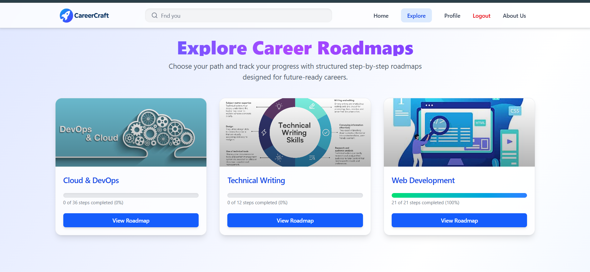
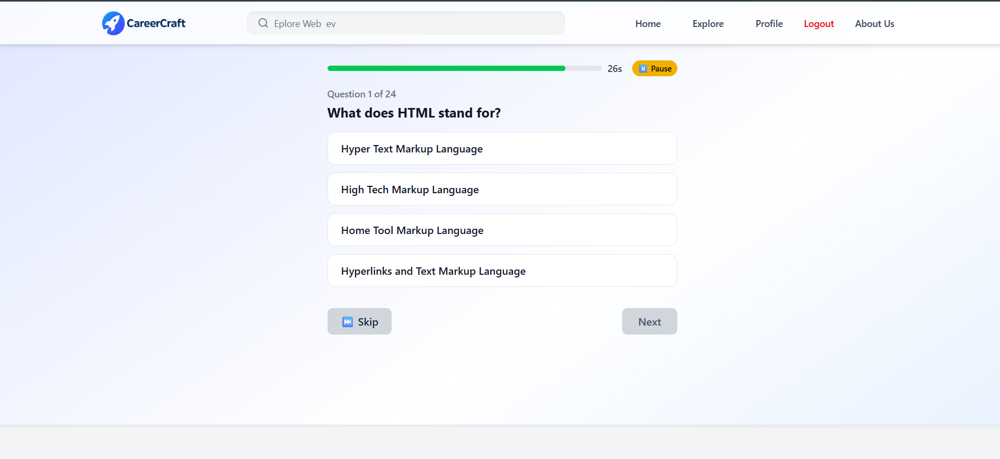
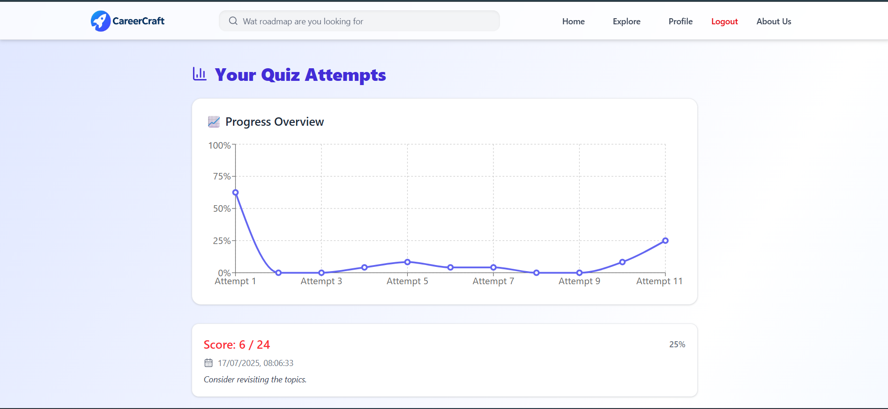

# 🎓 **CareerCraft**

**CareerCraft** is a full-stack MERN platform that helps users **explore career roadmaps**, **track their learning progress**, **take quizzes**, and **gain career insights** — all in one place.

> Built with **React**, **Node.js**, **Express**, **MongoDB**, and **JWT Authentication**, CareerCraft empowers students and professionals to navigate their tech careers efficiently.

---

## 🌟 **Key Features**

- 🔐 **Authentication** — Secure login/signup with JWT and protected routes.  
- 🧭 **Career Roadmaps** — Step-by-step learning paths for various tech careers.
- 📌 **Progress Tracking** — Track your roadmap journey with visual completion bars.
- 🧠 **Quiz Module** — Take topic-wise quizzes with timers, scoring, and result analysis.
- 📈 **Analytics Dashboard** — Visualize time spent, topic strengths, and activity.
- 🔍 **Live Search** — Instantly filter and find roadmaps with animated search.
- 📱 **Responsive Design** — Fully mobile-optimized using **Tailwind CSS**.
- 🔧 **Admin Control** *(coming soon)* — Add/edit roadmap and quiz data dynamically.
- 🔁 **Persistent Progress** — Quiz and step progress saved across sessions.

---

##  **Tech Stack**

| Layer        | Technologies                                     |
|--------------|--------------------------------------------------|
| **Frontend** | React.js (Vite), Tailwind CSS, Recharts          |
| **Backend**  | Node.js, Express.js                              |
| **Database** | MongoDB with Mongoose                            |
| **Auth**     | JWT (JSON Web Tokens)                            |
| **API**      | RESTful Routes using Axios                       |

---

##  **Getting Started**

### 1. Clone the Repository
```bash
git clone https://github.com/abhishek5703/careercraft.git
cd careercraft
```
### 2. Setup Backend
```bash
cd server
npm install
```
### 3. Setup Frontend
```bash
cd ../client
npm install
```
### 4. Environment Variables
```bash
MONGO_URI=your_mongodb_connection_string
JWT_SECRET=your_jwt_secret
PORT=5000
```
### 5. Run the App
Start the backend:
```bash
cd server
npm run dev
```
Start the frontend:
```bash
cd ../client
npm run dev
```
Visit: http://localhost:5173

## 🧪 How to Use

🔐 Login or Signup to access roadmaps and quizzes.

📚 Browse interactive tech career roadmaps.

✅ Click steps to mark as completed and track your progress.

🧠 Take quizzes after completing roadmap sections.

📊 View your quiz scores, topic-wise performance, and progress analytics.

🔎 Use search bar to find roadmaps in real-time.

📱 Enjoy a seamless experience across devices.


## 📸 Demo Screenshots

### 🏠 Homepage Preview  
Landing page with navigation and search bar.  


---

### 🧭 Roadmap Dashboard  
Browse career roadmaps and track your learning visually.  


---

### 🧠 Quiz Module with Timer  
Timed quizzes with scoring and review functionality.  


---

### 📊 Analytics Dashboard  
View your progress, topic performance, and learning stats.  



### 🤝 Contributing
Pull requests are welcome!

To contribute:

1. Fork the repo

2. Create a new branch
```bash
git checkout -b feature-name
```
3. Commit your changes

4. Push to your fork

5. Open a pull request

Open an issue first for significant feature suggestions or changes.

## 📬 Contact

**Developer**: Abhishek Kumar  
📧 **Email**: abhikumar898307@gmail.com  
🌐 **GitHub**: [github.com/abhishek5703](https://github.com/abhishek5703)  
💼 **LinkedIn**: [linkedin.com/in/abhishekkumar8983](https://www.linkedin.com/in/abhishekkumar8983/)


